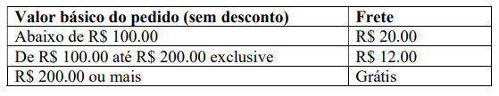
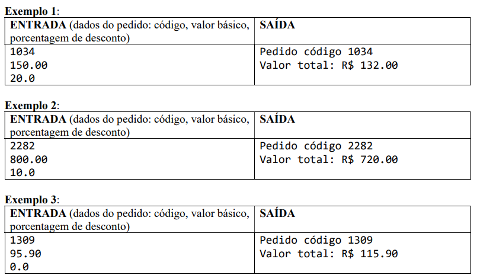
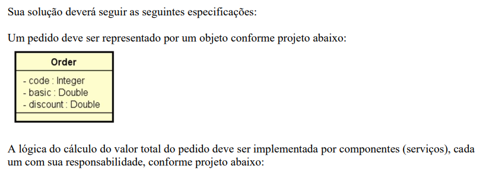
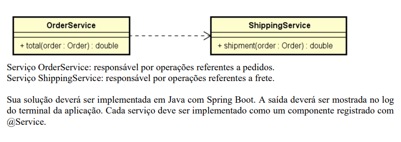
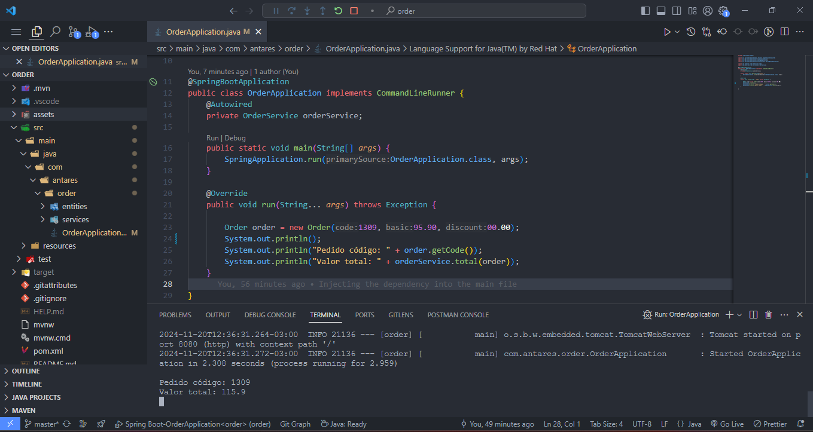

<h1 align="center">DESAFIO: Componentes e injeção de dependência</h1>

[ACESSAR  PROJETO](https://github.com/luizzlcs/order/blob/master/src/main/java/com/antares/order/OrderApplication.java)

## Funcionalidades
O projeto calcular o valor total de um pedido, considerando uma porcentagem
de desconto e o frete. O cálculo do valor total do pedido consiste em aplicar o desconto ao valor
básico do pedido, e adicionar o valor do frete. A regra para cálculo do frete é a seguinte: 

## Resultado do desafio

---
### Autor
Sou desenvolvedor fullstack com foco em entregar soluções completas e eficientes, combinando tecnologias modernas como Dart e Flutter para front-end e Java para back-end. Desde 2022, atuo na Ponto Care, onde desenvolvo aplicativos para Android e Web, sempre priorizando inovação, qualidade e a melhor experiência para o usuário.

